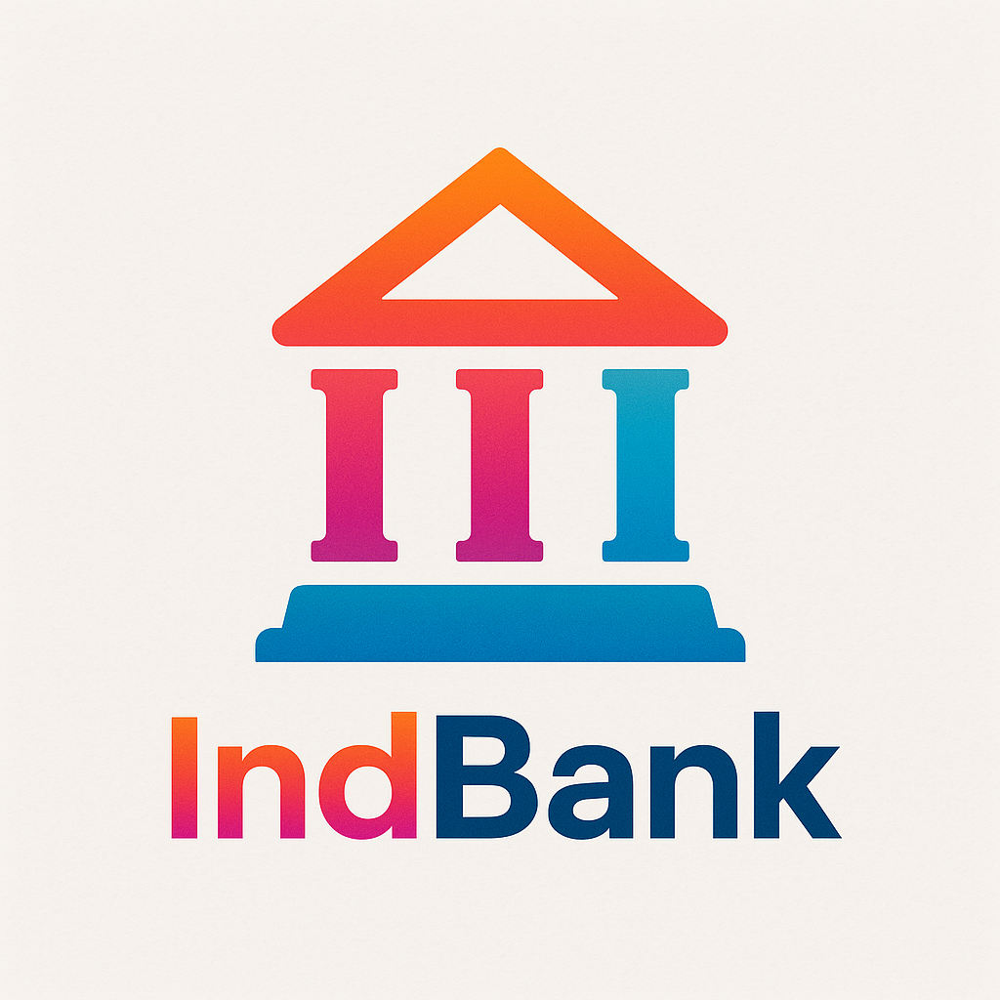

<p align="center"></p>

<p align="center"><a href="https://laravel.com" target="_blank"></a></p>

# 💼 IndBank – Digital Banking System

Welcome to **IndBank**, a responsive and secure digital banking platform developed using modern web technologies. This project simulates a real-world banking experience, offering interfaces for **Customers**, **Employees**, and **Admins** to manage banking operations such as account handling, fund transfers, loan applications, and much more.

---

## 🚀 Overview

IndBank provides a fully functional web-based banking portal where:

- 🧑‍💼 **Customers** can view and manage accounts, transfer funds, apply for loans.
- 🧑‍💻 **Admins** can approve account and loan requests, update customer details, and monitor activity.

---

## 👥 User Roles

### 🧍 Customer
- Login/Register securely
- **Email verification upon sign-in**
- **Two-Factor Authentication (2FA) for added security**
- View Account Summary (Savings/Current)
- Transfer funds (NEFT, IMPS, UPI)
- Apply for Loans (Home, Car, Personal, Education)
- Manage Profile and Password

### 🧑‍💼 Admin
- Approve pending customer accounts
- Approve pending loan applications
- View and verify customer KYC
- Block or Unblock customer accounts
- Update customer information

---

## 🌟 Features

### 🖥 UI/UX
- Modern and responsive Bootstrap 5 layout
- Consistent theming using **linear gradients**
- Font Awesome icons for intuitive interface
- Form validations and user feedback via **Toastify.js**

### 🔐 Authentication & Security
- Email verification during sign-in
- OTP-based **Forgot Password**
- **Two-Factor Authentication (2FA)** for enhanced login security
- Session-based user tracking
- Role-based access restrictions

### 📦 Modules
- **Login & Registration**
- **Dashboard** per role
- **Account Summary** with detailed views
- **Fund Transfer** form with live validation
- **Loan Application** with backend linkage
- **Profile Settings** for personal data updates

---

## 🛠 Tech Stack

| Technology    | Purpose                        |
|---------------|--------------------------------|
| HTML5/CSS3    | Page structure and design      |
| Bootstrap 5   | Responsive layout              |
| JavaScript    | Frontend logic                 |
| PHP (Laravel) | Backend services & API         |
| Toastify.js   | Notification & feedback        |
| Font Awesome  | Icons                          |
| MySQL         | Database                       |

---

## 🔧 Installation

> Make sure PHP, Composer, and MySQL are installed.

```bash
git clone https://github.com/ksamuel-soul/IndBank.git
cd IndBank
composer install
cp .env.example .env
php artisan key:generate
php artisan migrate
php artisan serve

